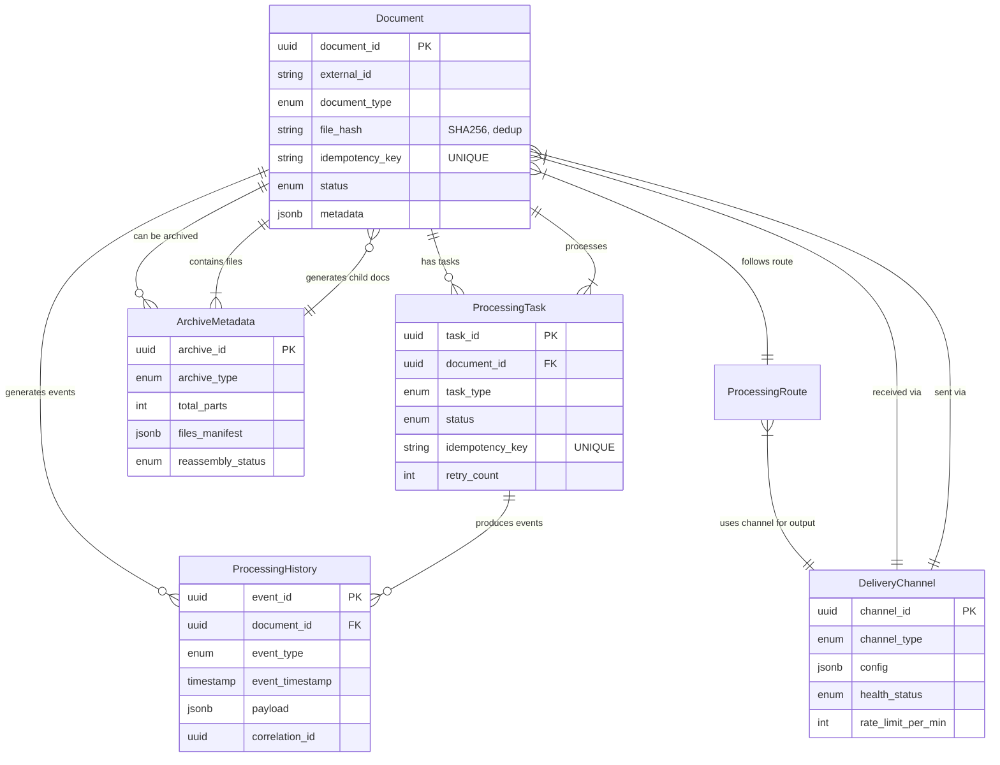
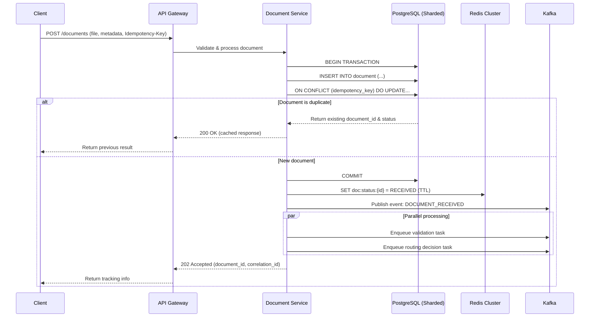
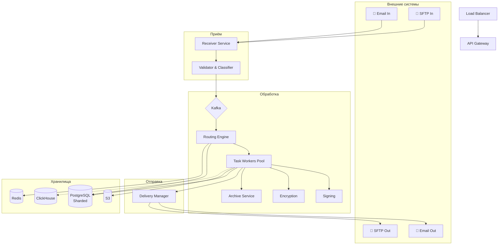
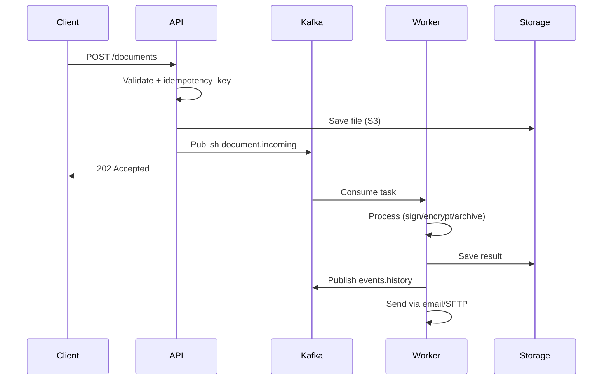
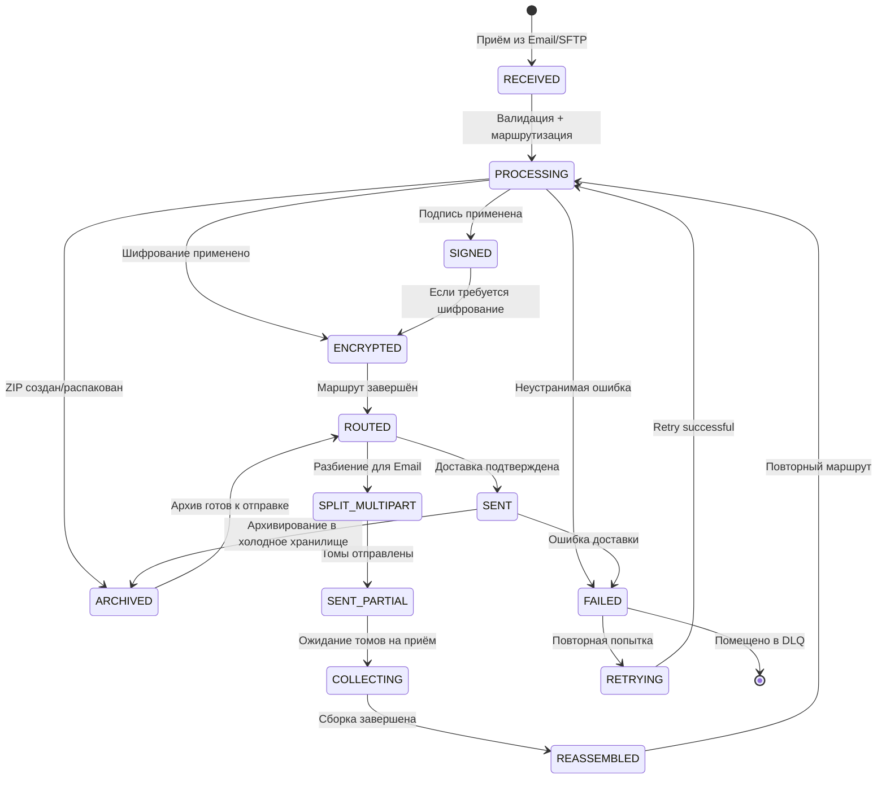

# Техническое решение проекта «Электронный документооборот»

## Введение
- **Цель проекта:**
  Предложить архитектуру highload-системы, способной надёжно обрабатывать поток документов, поддерживать разные варианты трансформации и доставки, а также выполнять как синхронные разовые операции, так и периодические задачи по расписанию.
---

## Глоссарий
| Термин        | Определение |
|---------------|-------------|
| Документ  | файл, который система принимает, хранит, обрабатывает и отправляет. |
| Электронная подпись  | механизм подтверждения целостности и подлинности документа. |
| Шифрование   | преобразование документа в защищённый вид, доступный только получателю с нужным ключом |
| Канал доставки  | способ получения или отправки документа, например email или SFTP. |
| Маршрут обработки  | последовательность операций, применяемых к документу перед отправкой. |
| ZIP-архив  | контейнер, содержащий один или несколько файлов. |
| Том архива  | часть многотомного архива. |
| Разовая задача  | однократная операция обработки и отправки документов. |
| Периодическая задача  | операция, которая выполняется по расписанию. |
| Идемпотентность  | возможность безопасно повторить обработку запроса или задачи без создания дублей и повторной отправки. |

---

## Функциональные требования

Система должна предоставлять следующие функции:

### Приём документов
Система должна позволять:
1. Принимать документы по электронной почте;
2. Принимать документы по SFTP;
3. Фиксировать метаданные документа и канала получения;
4. Определять тип входного документа.

Для каждого документа должны быть доступны как минимум:
1. Document_id;
2. Тип документа;
3. Время получения;
4. Канал получения;
5. Отправитель;
6. Получатель или группа получателей;
7. Текущий статус обработки.

### Поддержка форматов документов
Система должна поддерживать обработку как минимум следующих типов:
1. Текстовые файлы;
2. XLSX-файлы;
3. ZIP-архивы.

Система должна корректно определять тип документа и применять к нему допустимые операции обработки.

### Подписание и шифрование
Система должна поддерживать:
1. Отправку документа без дополнительных преобразований;
2. Подписание документа электронной подписью;
3. Подписание и последующее шифрование документа.

Необходимо предусмотреть возможность задавать требуемый режим обработки для каждого маршрута или задачи.

### Отправка документов
Система должна позволять:
1. Отправлять документы по электронной почте;
2. Отправлять документы по SFTP;
3. Настраивать маршрут отправки в зависимости от типа документа и получателя;
4. Фиксировать результат отправки.

### Формирование ZIP-архива
Система должна поддерживать сценарий, в котором:
1. Несколько входных файлов объединяются в один ZIP-архив;
2. Сформированный архив проходит требуемую обработку;
3. Архив отправляется одному или нескольким получателям.

### Разделение ZIP-архива
Система должна поддерживать сценарий, в котором:
1. Входной ZIP-архив распаковывается;
2. Содержащиеся в нём файлы выделяются как отдельные документы;
3. Отдельные файлы могут быть отправлены разным получателям.

### Работа с многотомными архивами
Для отправки по электронной почте система должна поддерживать:
1. Разделение архива на тома перед отправкой;
2. Отправку томов как отдельных вложений или сообщений;
3. Сборку многотомного архива из полученных томов;
4. Дальнейшую обработку собранного архива по стандартному маршруту.

### Разовые и периодические задачи
Система должна поддерживать:
1. Запуск разовой операции обработки и отправки документов;
2. Настройку периодических задач по расписанию;
3. Автоматический запуск периодических задач;
4. Контроль статуса выполнения задач.

### Маршрутизация и правила обработки
Система должна позволять настраивать правила, определяющие:
1. Из какого канала принимается документ;
2. Какие операции применяются к документу;
3. В какой канал и какому получателю документ должен быть отправлен;
4. Требуется ли архивирование, распаковка, подпись, шифрование или разбиение на тома.

### История обработки
Система должна позволять:
1. Просматривать историю обработки документа;
2. Видеть применённые шаги маршрута;
3. Видеть статусы получения, обработки и отправки;
4. Видеть результат выполнения разовой или периодической задачи.

---

## Нефункциональные требования

### Нагрузка
Система должна выдерживать:
1. До 100 документов в минуту на приём и отправку в пике;
2. Всплески нагрузки при массовом запуске периодических задач;
3. Работу с крупными архивами и пакетной обработкой файлов.

Основной характер нагрузки:
1. Смешанная нагрузка на чтение, запись, обработку и передачу файлов;
2. Значительная доля асинхронных операций;
3. Зависимость от внешних каналов доставки и получения.

### Производительность
Требования к производительности:
1. Регистрация и постановка документа в обработку — P95 не более 200 мс без учёта времени фактической передачи файла;
2. Типовые операции маршрутизации и выбора сценария обработки должны выполняться быстро;
3. Обработка и доставка документа могут быть асинхронными;
4. Длительные операции с архивами, подписью и шифрованием не должны блокировать приём новых документов.

### Надёжность
Система должна обеспечивать:
1. Отсутствие потери принятых документов;
2. Корректную работу при временной недоступности email- или SFTP-канала;
3. Возможность повторной отправки после временной ошибки;
4. Устойчивость к сбоям отдельных экземпляров сервисов;
5. Защиту от повторной обработки одного и того же документа.

### Консистентность
Для факта приёма документа и фиксации результата обработки важна надёжная запись.

Для вторичных представлений допускается eventual consistency, например:
1. Журналов и отчётов;
2. Агрегированной информации по задачам;
3. Представлений для мониторинга.

Система не должна:
1. Дублировать документы при повторной обработке;
2. Повторно отправлять документ без явного основания;
3. Терять связь между томами многотомного архива.

### Масштабируемость
Система должна горизонтально масштабироваться по следующим контурам:
1. Приём документов;
2. Обработка маршрутов;
3. Операции подписи и шифрования;
4. Операции архивирования и распаковки;
5. Отправка по email;
6. Отправка и получение по SFTP;
7. Выполнение периодических задач.

### Расширяемость
Система должна позволять:
1. Добавлять новые типы документов;
2. Добавлять новые каналы доставки;
3. Добавлять новые правила маршрутизации;
4. Расширять набор операций обработки без полной переработки системы.

---

## Пользовательские сценарии

### Сценарий: приём и пересылка входящего документа
1. Внешний отправитель загружает файл report.xlsx на SFTP-сервер системы.
2. Система регистрирует документ, присваивает document_id, фиксирует метаданные (время, канал, отправитель).
3. Система определяет тип файла и применяет правило маршрутизации: «подписать ЭП и отправить по Email».
4. Документ подписывается электронной подписью и отправляется получателю.
5. Получатель видит файл во входящих, система обновляет статус документа на «отправлен».

### Сценарий: формирование и отправка архива из нескольких файлов
1. Система по расписанию собирает 5 отчётов (*.txt, *.xlsx) за день.
2. Файлы объединяются в один архив daily_report.zip.
3. Архив подписывается ЭП и шифруется публичным ключом получателя.
4. Зашифрованный архив отправляется партнёру по SFTP.
5. Система фиксирует успешную отправку в журнале задач.

### Сценарий: распаковка архива и рассылка файлов разным получателям
1. Система получает по Email архив contracts.zip.
2. Архив распаковывается: внутри contract_A.pdf, contract_B.xlsx.
3. Для каждого файла создаётся отдельный document_id с привязкой к исходному архиву.
4. Применяются правила: contract_A → Email юристу, contract_B → SFTP бухгалтеру.
5. Файлы отправляются по назначению, статусы обновляются независимо.

### Сценарий: отправка крупного архива через многотомную рассылку по Email
1. Система готовит к отправке архив export.zip размером 50 МБ.
2. Так как лимит вложения Email — 25 МБ, архив разбивается на тома: .001, .002.
3. Каждый том отправляется отдельным письмом с общим идентификатором потока.
4. Получатель загружает все тома в систему.
5. Система собирает исходный export.zip, проверяет контрольную сумму и передаёт в обработку.

### Сценарий: разовая задача с идемпотентностью (защита от дублей)
1. Администратор через API запускает отправку пакета документов с уникальным request_id.
2. Система проверяет: если request_id уже обработан — возвращает существующий результат.
3. Если задача новая — документы ставятся в очередь на подпись и отправку.
4. После успешной отправки статус фиксируется как «выполнено».
5. При повторном вызове с тем же request_id дубликаты не создаются, документы не отправляются повторно.

### Сценарий: восстановление после сбоя канала доставки
1. Система пытается отправить документ по SFTP, но сервер временно недоступен.
2. Операция помечается как `ошибка_доставки`, документ возвращается в очередь повторных попыток.
3. Через заданный интервал система автоматически повторяет отправку.
4. При успешной доставке статус обновляется на «отправлен», в журнал записывается время и результат.
5. Если после N попыток канал не восстановлен — задача переходит в статус `требует_вмешательства`, администратор получает уведомление.

---

## Модель данных
### Основные сущности

| Сущность        | Определение |
|-----------------|-------------|
| Document | представляет собой любой файл, принятый, обрабатываемый или отправляемый системой. Является корнем всех операций и связей |
| ProcessingTask | представляет атомарную операцию, выполняемую над документом в рамках маршрута обработки |
| ProcessingRoute | описывает декларативную последовательность операций, применяемых к документу в зависимости от его характеристик и бизнес-правил. |
| ArchiveMetadata  | описывает структуру и состояние архивных операций — как входных, так и сгенерированных системой |
| DeliveryChannel  | абстрагирует параметры подключения и конфигурацию внешних каналов связи (email, SFTP). |
| ProcessingHistory  | иммутабельный журнал всех значимых событий жизненного цикла документа для аудита, отладки и восстановления состояния |

### Идемпотентность и дедупликация
Система предотвращает дублирование обработки на трёх уровнях: (1) при приёме документа — по комбинации file_hash + `sender_id` + timestamp; (2) при выполнении операций — через idempotency_key и атомарную вставку INSERT ... ON CONFLICT; (3) при отправке — по уникальному ключу (channel_id, recipient, message_hash). Это гарантирует, что каждый документ и каждая операция будут обработаны ровно один раз, даже при повторных запросах или сбоях сети.
При повторном обращении система возвращает результат предыдущего успешного выполнения, а не запускает обработку заново. Такой подход обеспечивает семантику «точно один раз» на бизнес-уровне, сохраняя устойчивость к ретраям и временной недоступности внешних каналов.

Пример  обработки документа с идемпотентностью.

---

##  Архитектура системы
### Концепция

Система построена на микросервисной архитектуре с event-driven подходом и CQRS. Ключевые принципы: асинхронная обработка через очереди, идемпотентность операций, горизонтальное масштабирование, разделение ответственности компонентов.

### Архитектурная схема

### Схема данных 

### Масштабирование и отказоустойчивость

RPO/RTO: 5 минут / 

### Безопасность

    In-transit: TLS 1.3, mTLS между сервисами
    At-rest: TDE для PostgreSQL, SSE-KMS для S3
    Secrets: HashiCorp Vault с ротацией ключей
    Защита: WAF, rate limiting, antivirus-scan входящих файлов

### Мониторинг
Stack: Prometheus + Grafana (метрики), EFK/Loki (логи), Jaeger (трейсы).
Ключевые метрики:

    Производительность: P95 < 200ms, error rate < 0.1%
    Очереди: Kafka lag < 1000
    Бизнес: delivery success rate > 99.5%
---

### Технические сценарии

#### Приём и регистрация документа

- **Триггер:** Поступление файла по Email или SFTP.
- **Поток:**
    1. Receiver извлекает файл и метаданные (отправитель, время, канал).
    2. Validator определяет MIME/тип, проверяет сигнатуру, вычисляет file_hash (SHA256).
    3. Проверка идемпотентности: если hash + sender + timestamp уже существует, возвращается предыдущий результат.
    4. Файл сохраняется в S3, запись создаётся в PostgreSQL (status=RECEIVED).
    5. В Kafka публикуется DocumentReceived.
- **Результат:** Документ зарегистрирован, клиент получает 202 Accepted с document_id и correlation_id.

#### Маршрутизация и трансформация (подпись/шифрование/архив)

- **Триггер:** Событие DocumentReceived / DocumentValidated в Kafka.
- **Поток:**
    1. Routing Engine сопоставляет метаданные с активными правилами (trigger_condition).
    2. Генерируется последовательность задач: SIGN → ENCRYPT → ARCHIVE → SPLIT.
    3. Задачи публикуются в `tasks.processing` с приоритетом и idempotency_key.
    4. Task Workers забирают задачи, проверяют идемпотентность, выполняют операцию, сохраняют результат в S3, обновляют статус в БД.
- **Результат:** Документ прошёл заданный маршрут, статус изменён на ROUTED, готов к отправке.

#### Отправка и работа с многотомными архивами

- **Обычная отправка:** Delivery Manager выбирает канал (Email/SFTP), применяет rate-limit, отправляет, фиксирует DELIVERY_CONFIRMED или FAILED.
- **Многотомный архив (Email):**
    1. Archive Service разбивает файл на тома (≤25 MB), создаёт MultipartArchiveGroup.
    2. Каждый том отправляется отдельным письмом/вложением.
    3. При получении томов система фиксирует их в группе, проверяет полноту и хеши.
    4. После получения всех томов выполняется сборка, создаётся новый Document, запускается стандартный маршрут.
- **Результат:** Документ доставлен или томы собраны и поставлены в обработку без потерь.

#### Разовые и периодические задачи

- **Разовая задача:** Вызов API → создание batch-задач → публикация в Kafka → выполнение воркерами → возврат статуса COMPLETED/FAILED.
- **Периодическая задача:** Scheduler (K8s CronJob/Quartz) → проверка расписания → генерация задач → обработка стандартным контуром. Блокировка повторного запуска, если предыдущее выполнение ещё активно.
- **Результат:** Контролируемое выполнение пакетных или scheduled операций с полным аудитом.

#### Обработка ошибок и идемпотентность

- **Повторные запросы:** idempotency_key на всех уровнях гарантирует возврат предыдущего результата без повторной обработки.
- **Временные сбои каналов:** Retry с exponential backoff (3 попытки) → при неустранимых ошибках задача уходит в DLQ с алертом.
- **Отказ сервиса:** Circuit breaker изолирует компонент, Kafka буферизует события, воркеры переключаются на здоровые ноды.
- **Результат:** Система не теряет данные, не создаёт дубли, корректно восстанавливается после transient-ошибок.

#### Аудит и история обработки

- **Поток:** Каждое значимое действие генерирует событие в `events.history` (Kafka → ClickHouse/TimescaleDB).
- **Доступ:** API возвращает хронологию по document_id с event_timestamp, event_type, payload и correlation_id.
- **Результат:** Полная трассировка жизненного цикла для отладки, compliance и аналитики.

---

